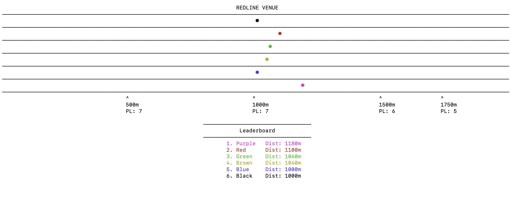

# **Redline Regatta**
Redline Regatta is a CLI game ispired by modern racing board games, where up to six players compete in a 2000m rowing race by pushing their limits, without breaking.



## How it works
Players race to be the first to cross the finish line by carefully managing effort and timing. Each player manages their Stroke Rate (35, 40 and 45 spm) and three types of cards: Pace, Instability and Stamina Cards, to control how fast their boat moves. 

At the start of each round, player chooses a Stroke Rate, which sets how many cards they can play and how much strain they place on their crew, they then select Pace and Instability Cards from their hand to generate movement for the turn.

As the race progress, the boat's stamina gradually deplets, clogging the player's hand with Stamina Cards, that reduces available options and forces the player to choose: slow down to recover or push harder and risk mistakes. Meanwhile, players who fall behind can benefit from situational bonuses, creating opportunities for dramatic late-race camebacks. 

Every race becomes a test of pacing and precison under pressure, as players push their boats limits, right up to the point where everything starts to fall apart.

## How to Play
To start playing this game, you can follow these steps:

1. **Clone the repository:**
    ```
    $ git clone https://github.com/Gaoliveira04/rowing-game.git
    ```
2. **Enter directory:**
    ```
    $ cd /path/to/redline-regatta
    ```
3. **Run the application:** Use arrow keys and enter key to navegate and play
    ```
    $ python3 main.py
    ```

## File Structure
```text
redline-regatta/
├── main.py                 # Game entry point
├── config.py               # Global paths        
├── README.md               # Project documentation
├── src/
│   ├── controllers/
│   │   ├── menu.py         # 
│   │   └── game.py         #
│   ├── engine/
│   │   ├── constants.py    # Game values
│   │   ├── boat.py         # Boat state
│   │   └── race_logic.py   # Rules, movement, bonus
│   └── interface/
│       ├── interaction.py  # Key capture
│       └── draw.py         # 
├── analysis/
│   └── crab_rate.py        # Balance simulation
└── assets/
    ├── rules.txt           #
    ├── credits.txt         #
    └── images/             #
```

## Contributing
If your are reading this you should contribute! Feel free to:
- Open pull requests for UI improvements or new features.
- Give feedback 

## License


---
Built by Gabriel Oliveira